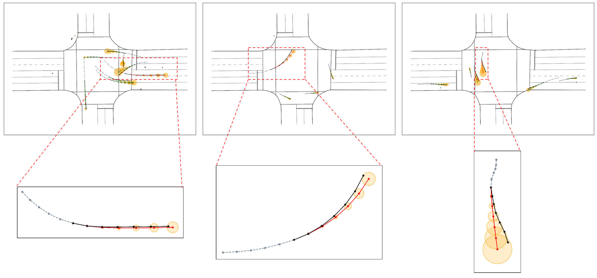

# PMBP

[//]: # ([Wenbo Shao]&#40;https://scholar.google.com/citations?user=nJgFCn0AAAAJ&hl=zh-CN&oi=ao&#41;)
Wenbo Shao, Boqi Li, Wenhao Yu, Jiahui Xu, Hong Wang

Tsinghua University

## Abstract
Accurate trajectory prediction is vital for various applications, including autonomous vehicles. However, the complexity and limited transparency of many prediction algorithms often result in black-box models, making it challenging to understand their limitations and anticipate potential failures. This further raises potential risks for systems based on these prediction models. This study introduces the performance monitor for black-box trajectory prediction model (PMBP) to address this challenge. The PMBP estimates the performance of black-box trajectory prediction models online, enabling informed decision-making. The study explores various methods' applicability to the PMBP, including anomaly detection, machine learning, deep learning, and ensemble, with specific monitors designed for each method to provide online output representing prediction performance. Comprehensive experiments validate the PMBP's effectiveness, comparing different monitoring methods.
Results show that the PMBP effectively achieves promising monitoring performance, particularly excelling in deep learning-based monitoring. It achieves improvement scores of 0.81 and 0.79 for average prediction error and final prediction error monitoring, respectively, outperforming previous white-box and gray-box methods. Furthermore, the PMBP's applicability is validated on different datasets and prediction models, while ablation studies confirm the effectiveness of the proposed mechanism. Hybrid prediction and autonomous driving planning experiments further show the PMBP's value from an application perspective. 

## Method Overview


## Citation
```
@article{shao2023likely,
  title={When Is It Likely to Fail? Performance Monitor for Black-Box Trajectory Prediction Model},
  author={Shao, Wenbo and Li, Boqi and Yu, Wenhao and Xu, Jiahui and Wang, Hong},
  journal={Authorea Preprints},
  year={2023},
  publisher={Authorea}
}
```

## Visualization

[//]: # (|  |  |  |)


## Autonoumous Driving Planning

| <video muted controls width=380> <source src="./src/Planning_05.mp4"  type="video/mp4"> </video> | <video muted controls width=380> <source src="./src/Planning_06.mp4"  type="video/mp4"> </video> |

| <video muted controls width=380> <source src="./src/Planning_01.mp4"  type="video/mp4"> </video> | <video muted controls width=380> <source src="./src/Planning_02.mp4"  type="video/mp4"> </video> |

| <video muted controls width=380> <source src="./src/Planning_03.mp4"  type="video/mp4"> </video> | <video muted controls width=380> <source src="./src/Planning_04.mp4"  type="video/mp4"> </video> |


## Contact
If you have any questions, feel free to contact us (swb19@mails.tsinghua.edu.cn).
